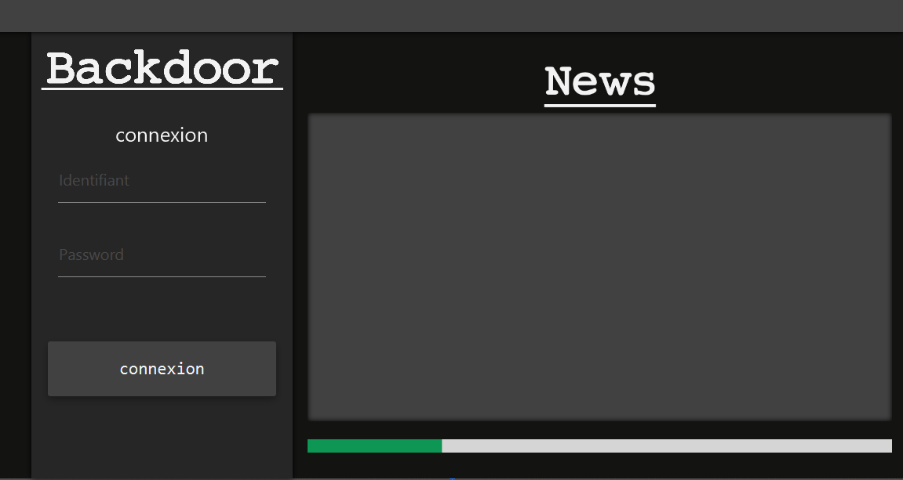
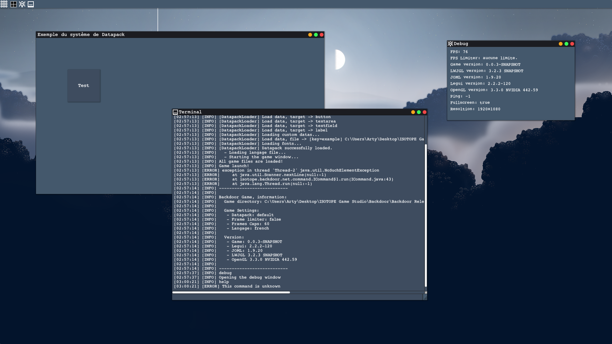
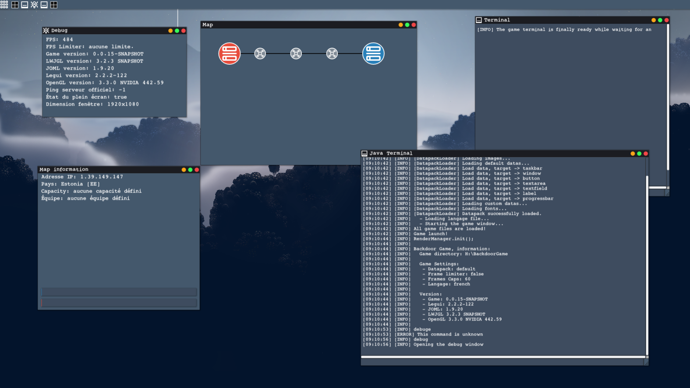
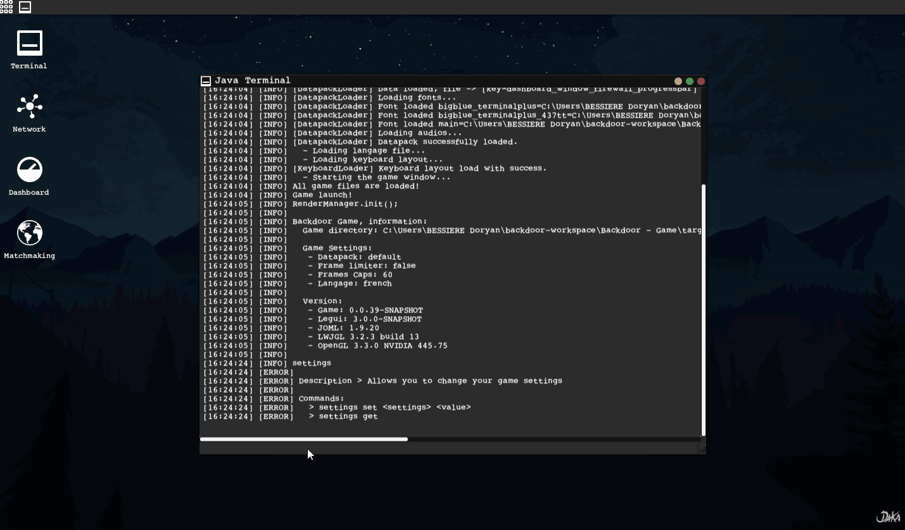
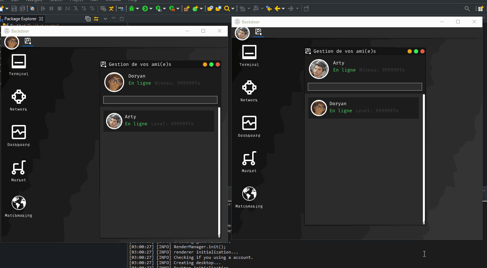
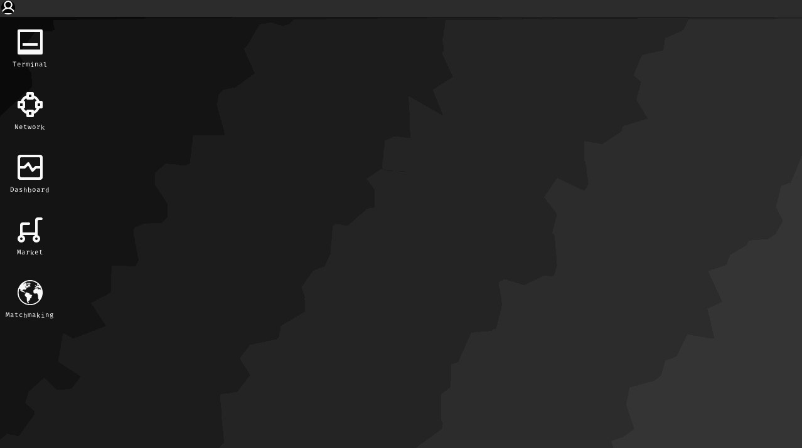

# Backdoor Game
Developpe par IsotopeStudio (Doryan Bessiere)

Backdoor est un MOBA se deroulant dans un environnement de bureau simule. L objectif principal est de capturer des zones appelees Proxies en les piratant. Le jeu mise sur une experience competitive, avec un systeme de classement et des parties classees, tout en proposant une campagne solo et plusieurs modes multijoueur.

## Sommaire
- Apercu
- Visuels
- Gameplay et objectifs
- Modes de jeu
- Social et cooperation
- Personnalisation du bureau
- Tech stack et pre requis
- Lancer le projet
- Structure du depot

## Apercu
Backdoor vise un large public, du joueur occasionnel au joueur competitif. Le bureau simule est totalement personnalisable et editable, ce qui sert a la fois l immersion et la strategie.

## Visuels

## Gameplay et objectifs
- Capturer des Proxies en piratant des zones du bureau.
- Controler la carte et gerer la pression sur plusieurs fronts.
- Miser sur la coordination et le timing pour prendre l avantage.

## Modes de jeu
- Multijoueur competitif avec matchmaking et classement.
- Campagne solo scenarisee.
- Variantes competitives selon les objectifs de match.

## Social et cooperation
- Creation d equipes et d alliances.
- Raids coordonnes pour des attaques groupees.
- Dimension communautaire centrale a l experience.

## Personnalisation du bureau
- Bureau simule personnalisable et editable.
- Interface modulable pour adapter la strategie et le confort visuel.

## Tech stack et pre requis
- Java 8 (source et target 1.8).
- Maven pour la compilation et le packaging.
- Dependances graphiques et math (voir [pom.xml](pom.xml)).

## Lancer le projet
- Build Maven: `mvn package`
- Point d entree principal: [src/isotopestudio/backdoor/game/BackdoorGame.java](src/isotopestudio/backdoor/game/BackdoorGame.java)
- Execution conseillee via un IDE Java en definissant la classe principale.

## Structure du depot
- [src](src) code source principal du jeu.
- [resources](resources) assets et ressources.
- [docs](docs) medias et visuels utilises dans ce README.
- [target](target) sorties de build (si generees).
