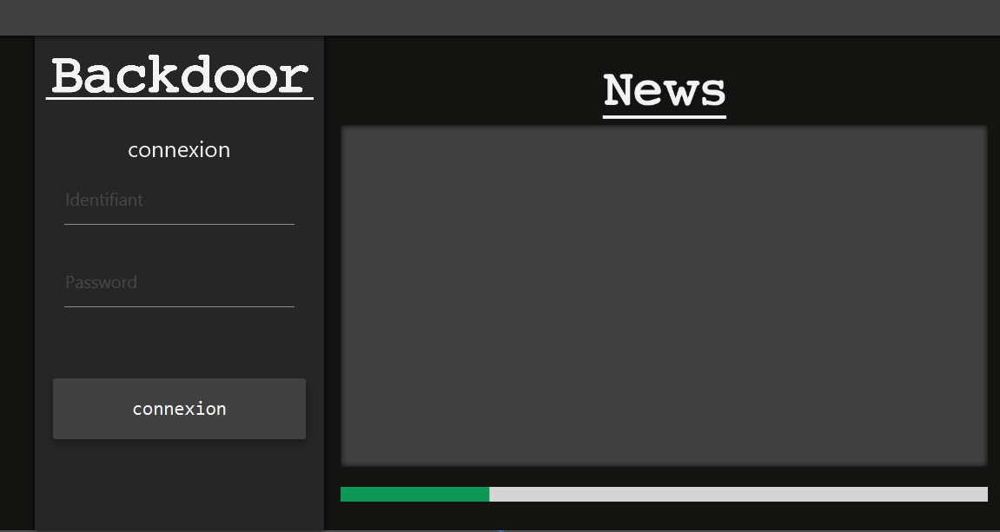
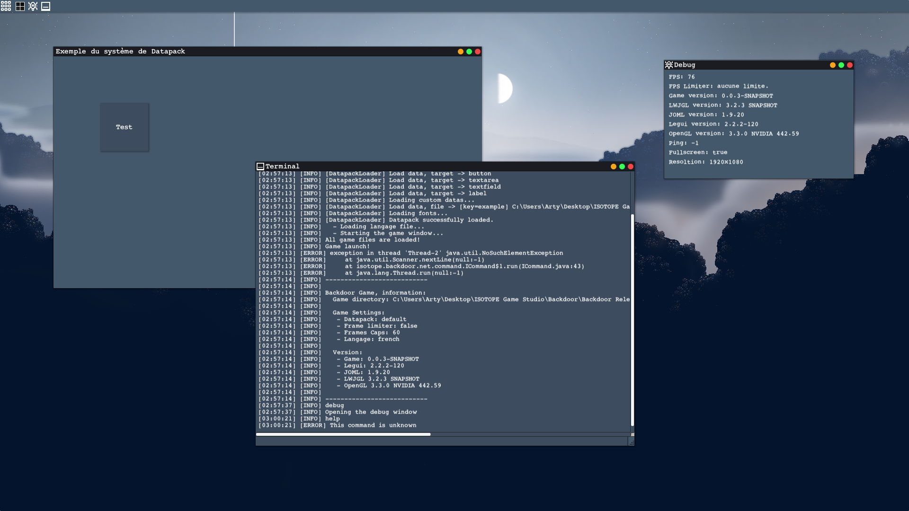
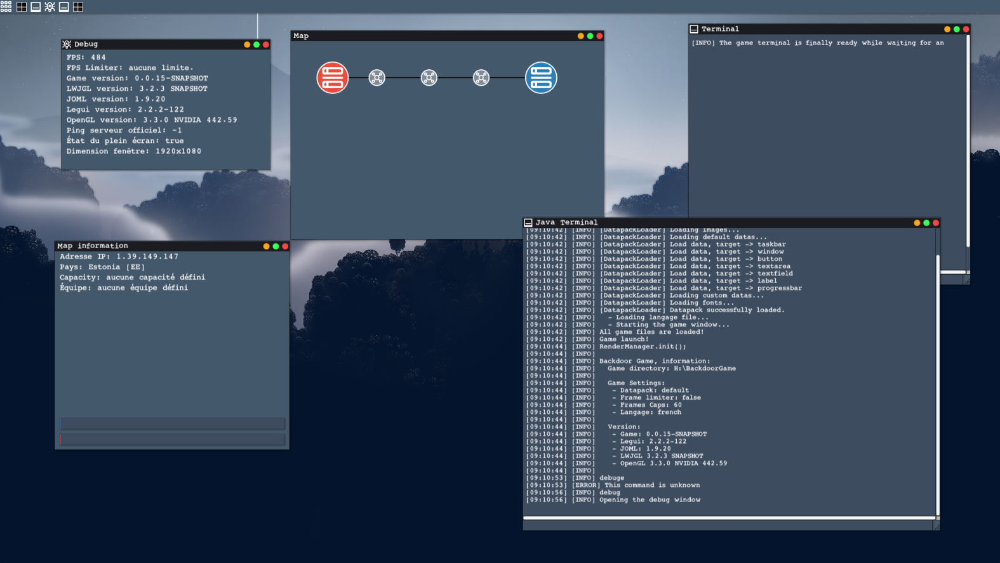
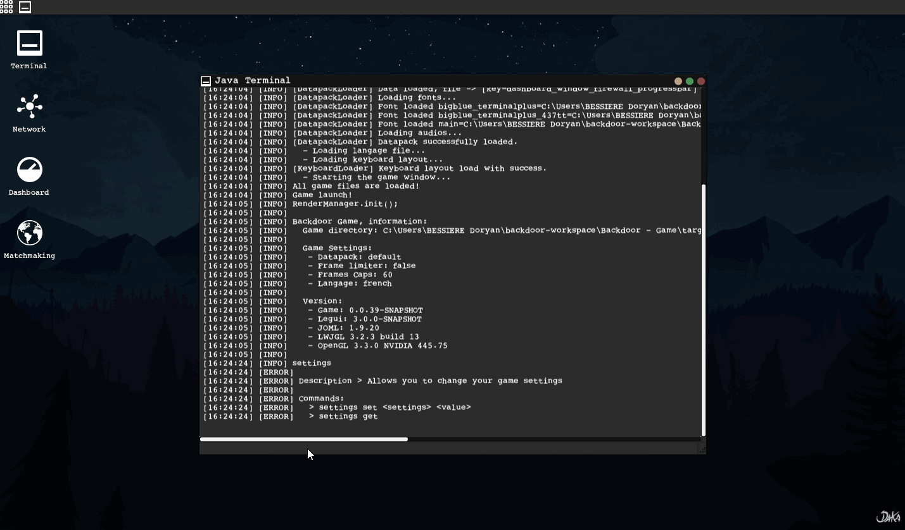
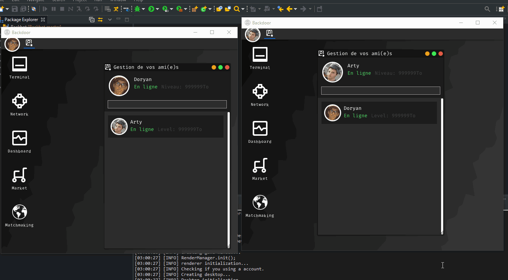
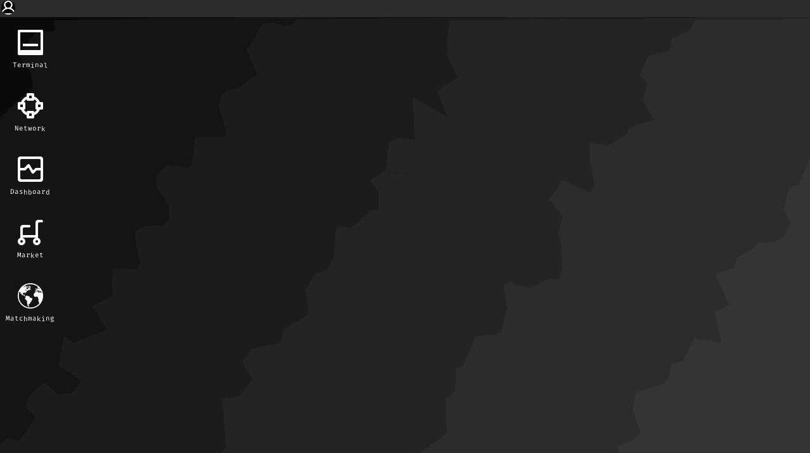

# Backdoor Game

Backdoor is a MOBA set in a simulated desktop environment. The main objective is to capture zones called Proxies by hacking them. The game focuses on a competitive experience, featuring a ranking system and ranked matches, while also offering a solo campaign and multiple multiplayer modes.

## Table of Contents

* Overview
* Visuals
* Gameplay and objectives
* Game modes
* Social and cooperation
* Desktop customization
* Tech stack and prerequisites
* Running the project
* Repository structure

## Overview

Backdoor targets a wide audience, from casual players to competitive gamers. The simulated desktop is fully customizable and editable, enhancing both immersion and strategy.

## Visuals

## Gameplay and Objectives

* Capture Proxies by hacking desktop zones
* Control the map and manage pressure across multiple fronts
* Rely on coordination and timing to gain the advantage

## Game Modes

* Competitive multiplayer with matchmaking and ranking
* Story-driven solo campaign
* Competitive variations depending on match objectives

## Social and Cooperation

* Team and alliance creation
* Coordinated raids for group attacks
* Strong community-driven experience

## Desktop Customization

* Fully customizable and editable simulated desktop
* Modular interface to adapt strategy and visual comfort

## Tech Stack and Prerequisites

* Java 8 (source and target 1.8)
* Maven for build and packaging
* Graphics and math dependencies (see [pom.xml](pom.xml))

## Running the Project

* Maven build: `mvn package`
* Main entry point: [src/isotopestudio/backdoor/game/BackdoorGame.java](src/isotopestudio/backdoor/game/BackdoorGame.java)
* Recommended to run via a Java IDE by setting the main class

## Repository Structure

* [src](src): main game source code
* [resources](resources): assets and resources
* [docs](docs): media and visuals used in this README
* [target](target): build outputs (if generated)
